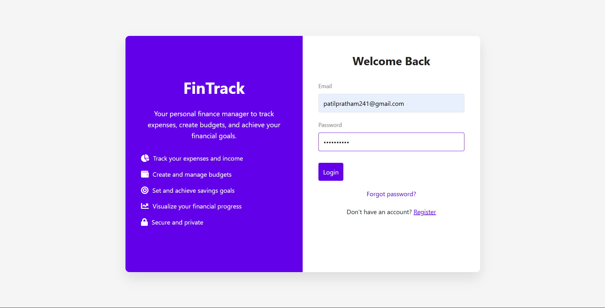
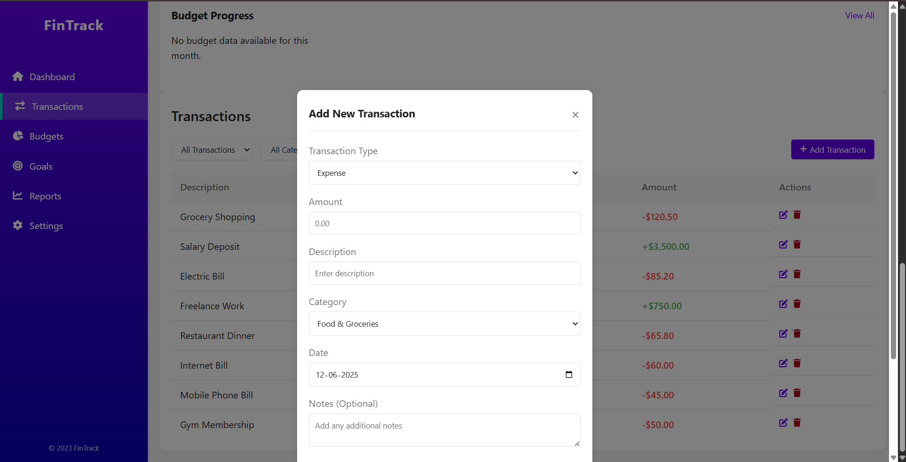
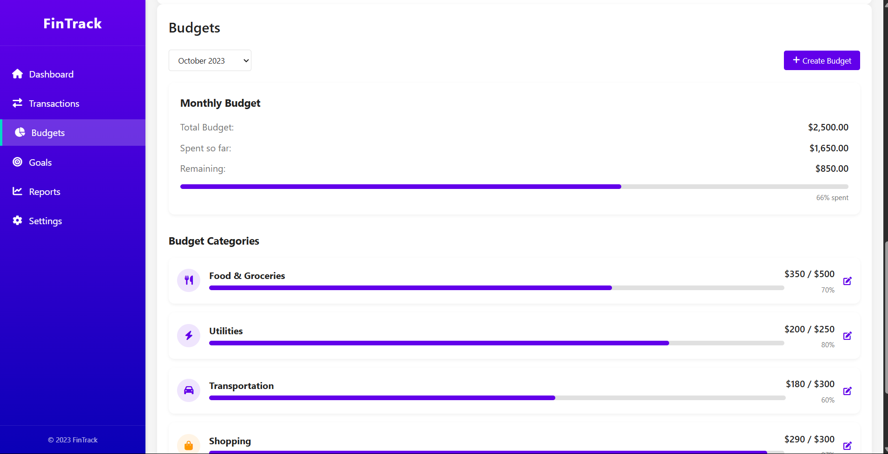
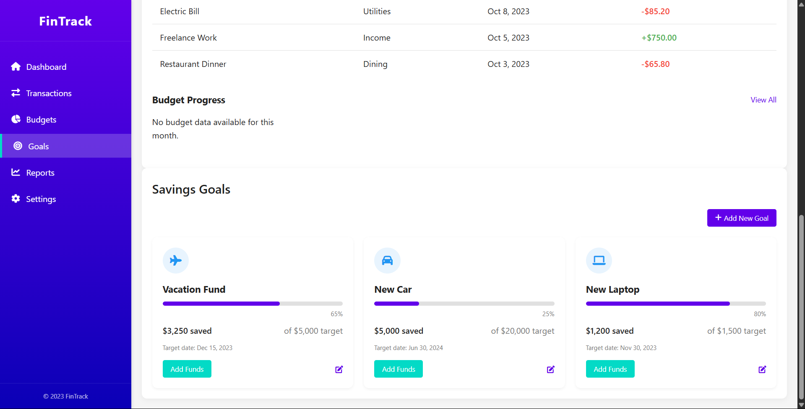
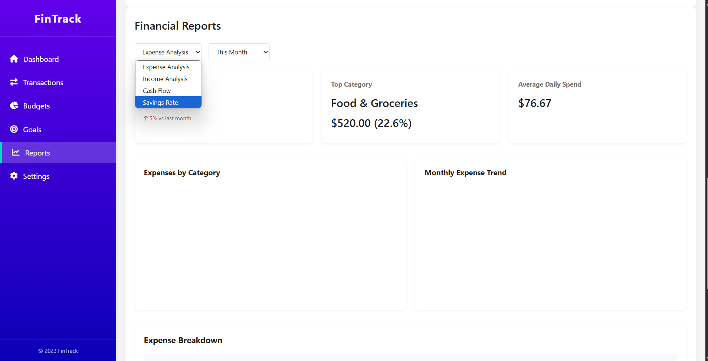
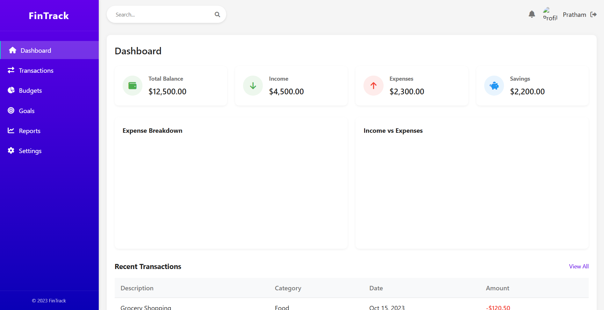

# 💸 Personal Finance Manager

A full-stack web application that enables users to manage their income, expenses, savings goals, and view monthly/yearly financial reports. Developed as part of the **System Design and Implementation** assignment.

---

## 📸 Screenshots

> All screenshots are located inside the `Screens/` folder of this repository.

### 🔐 Register User


### 🔑 Login


### 💵 Transaction


### 📈 Budget


### 🎯 Goals


### 📊 Reports


### 📋 Dashboard


---

## 🧰 Technology Stack

| Layer        | Technology             |
|--------------|------------------------|
| Language     | Java 17               |
| Framework    | Spring Boot 3.x        |
| Security     | Spring Security (JWT)  |
| Build Tool   | Maven                  |
| Database     | H2 (in-memory) / MySQL |
| Testing      | JUnit 5, Mockito       |
| Frontend     | HTML, CSS, JavaScript  |

---

## ✅ Features

- 🔐 User registration and login (JWT/session)
- 📥 Create, view, update, and delete transactions
- 🧾 Custom category creation and management
- 🎯 Savings goal tracking and progress calculation
- 📊 Financial reporting (monthly & yearly)
- 🔐 Secure API access using JWT/session
- 🧪 Fully tested with 86/86 test cases passed

---

## 🔗 API Endpoints (As Per Assignment)

### 👤 User Authentication

| Method | Endpoint            | Description       |
|--------|---------------------|-------------------|
| POST   | /api/auth/register  | Register a user   |
| POST   | /api/auth/login     | Login user        |
| POST   | /api/auth/logout    | Logout session    |

---

### 💰 Transactions

| Method | Endpoint                   | Description              |
|--------|----------------------------|--------------------------|
| POST   | /api/transactions          | Create transaction       |
| GET    | /api/transactions          | Get transactions (filter by date/category) |
| PUT    | /api/transactions/{id}     | Update transaction       |
| DELETE | /api/transactions/{id}     | Delete transaction       |

---

### 📁 Categories

| Method | Endpoint                  | Description              |
|--------|---------------------------|--------------------------|
| GET    | /api/categories           | View all categories      |
| POST   | /api/categories           | Add custom category      |
| DELETE | /api/categories/{name}    | Delete custom category   |

---

### 🎯 Savings Goals

| Method | Endpoint               | Description              |
|--------|------------------------|--------------------------|
| POST   | /api/goals             | Create savings goal      |
| GET    | /api/goals             | View all goals           |
| GET    | /api/goals/{id}        | View goal by ID          |
| PUT    | /api/goals/{id}        | Update goal              |
| DELETE | /api/goals/{id}        | Delete goal              |

---

### 📊 Reports

| Method | Endpoint                                   | Description          |
|--------|--------------------------------------------|----------------------|
| GET    | /api/reports/monthly/{year}/{month}        | Monthly report       |
| GET    | /api/reports/yearly/{year}                 | Yearly report        |

---

## ✅ Test Script Result

To verify all features, the official test script provided with the assignment was executed:

```bash
bash financial_manager_tests.sh http://localhost:3000/api
